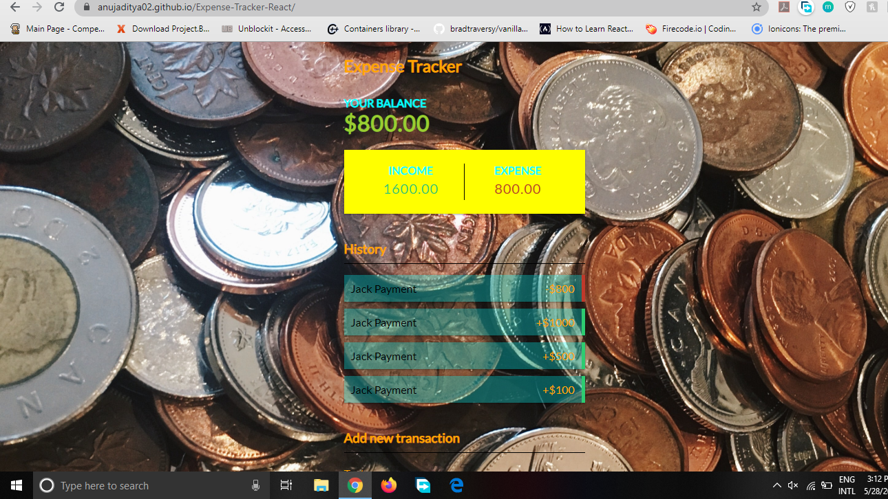
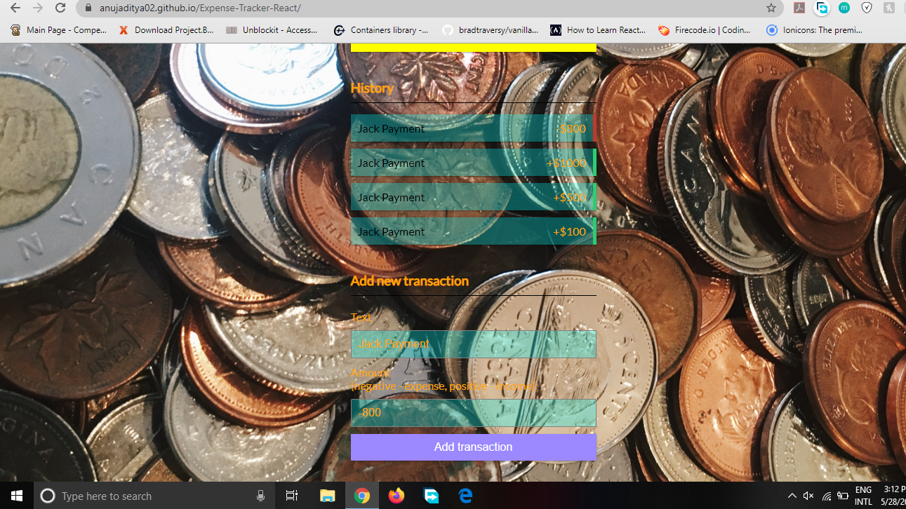

<h1>Expense Tracker </h1>

Created using React Hooks and Context API 

Used to keep track of various expenses incurred and keeps track of current income of an individual.

<a href = "https://anujaditya02.github.io/Expense-Tracker-React/">Expense Tracker App </a>

<h2>ScreenShot</h2>

